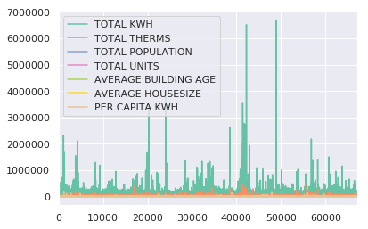
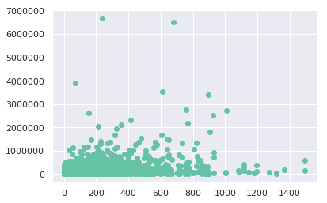
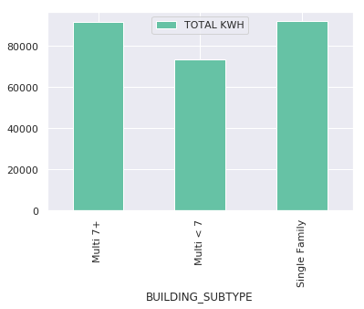
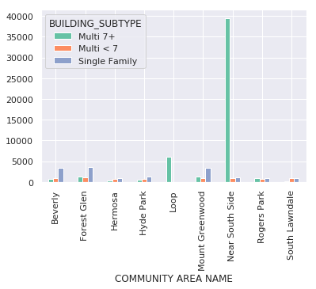

# Prerequisite Libraries 
1. sudo python3 -m pip install pandas
2. sudo python3 -m pip install numpy
3. sudo python3 -m pip install matplotlib
4. sudo python3 -m pip install seaborn
5.sudo python3 -m pip install sklearn

## Include the Required Libraries for Analysis


```python
%matplotlib inline
```


```python
import matplotlib.pyplot as plt
```


```python
import matplotlib
```


```python
import numpy as np
```


```python
import seaborn as sns
```


```python
import sklearn as kl
```


```python
import pandas as pd
```

### Load Energy Usage 2010 thru Panadas
* [Energy Usage](https://data.lacity.org/api/views/nxs9-385f/rows.csv?accessType=DOWNLOAD)


```python
df = pd.read_csv('Energy_Usage_2010.csv')
```


```python
df.head()
```


<div>
<style scoped>
    .dataframe tbody tr th:only-of-type {
        vertical-align: middle;
    }

    .dataframe tbody tr th {
        vertical-align: top;
    }

    .dataframe thead th {
        text-align: right;
    }
</style>
<table border="1" class="dataframe">
  <thead>
    <tr style="text-align: right;">
      <th></th>
      <th>COMMUNITY AREA NAME</th>
      <th>CENSUS BLOCK</th>
      <th>BUILDING TYPE</th>
      <th>BUILDING_SUBTYPE</th>
      <th>KWH JANUARY 2010</th>
      <th>KWH FEBRUARY 2010</th>
      <th>KWH MARCH 2010</th>
      <th>KWH APRIL 2010</th>
      <th>KWH MAY 2010</th>
      <th>KWH JUNE 2010</th>
      <th>...</th>
      <th>TOTAL POPULATION</th>
      <th>TOTAL UNITS</th>
      <th>AVERAGE STORIES</th>
      <th>AVERAGE BUILDING AGE</th>
      <th>AVERAGE HOUSESIZE</th>
      <th>OCCUPIED UNITS</th>
      <th>OCCUPIED UNITS PERCENTAGE</th>
      <th>RENTER-OCCUPIED HOUSING UNITS</th>
      <th>RENTER-OCCUPIED HOUSING PERCENTAGE</th>
      <th>OCCUPIED HOUSING UNITS</th>
    </tr>
  </thead>
  <tbody>
    <tr>
      <th>0</th>
      <td>Archer Heights</td>
      <td>1.703157e+14</td>
      <td>Residential</td>
      <td>Multi &lt; 7</td>
      <td>NaN</td>
      <td>NaN</td>
      <td>NaN</td>
      <td>NaN</td>
      <td>NaN</td>
      <td>NaN</td>
      <td>...</td>
      <td>89.0</td>
      <td>24.0</td>
      <td>2.0</td>
      <td>71.33</td>
      <td>3.87</td>
      <td>23.0</td>
      <td>0.9582</td>
      <td>9.0</td>
      <td>0.3910</td>
      <td>23.0</td>
    </tr>
    <tr>
      <th>1</th>
      <td>Ashburn</td>
      <td>1.703170e+14</td>
      <td>Residential</td>
      <td>Multi 7+</td>
      <td>7334.0</td>
      <td>7741.0</td>
      <td>4214.0</td>
      <td>4284.0</td>
      <td>2518.0</td>
      <td>4273.0</td>
      <td>...</td>
      <td>112.0</td>
      <td>67.0</td>
      <td>2.0</td>
      <td>41.00</td>
      <td>1.81</td>
      <td>62.0</td>
      <td>0.9254</td>
      <td>50.0</td>
      <td>0.8059</td>
      <td>62.0</td>
    </tr>
    <tr>
      <th>2</th>
      <td>Auburn Gresham</td>
      <td>1.703171e+14</td>
      <td>Commercial</td>
      <td>Multi &lt; 7</td>
      <td>NaN</td>
      <td>NaN</td>
      <td>NaN</td>
      <td>NaN</td>
      <td>NaN</td>
      <td>NaN</td>
      <td>...</td>
      <td>102.0</td>
      <td>48.0</td>
      <td>3.0</td>
      <td>86.00</td>
      <td>3.00</td>
      <td>34.0</td>
      <td>0.7082</td>
      <td>23.0</td>
      <td>0.6759</td>
      <td>34.0</td>
    </tr>
    <tr>
      <th>3</th>
      <td>Austin</td>
      <td>1.703125e+14</td>
      <td>Commercial</td>
      <td>Multi &lt; 7</td>
      <td>NaN</td>
      <td>NaN</td>
      <td>NaN</td>
      <td>NaN</td>
      <td>NaN</td>
      <td>NaN</td>
      <td>...</td>
      <td>121.0</td>
      <td>56.0</td>
      <td>2.0</td>
      <td>84.00</td>
      <td>2.95</td>
      <td>41.0</td>
      <td>0.7321</td>
      <td>32.0</td>
      <td>0.7800</td>
      <td>41.0</td>
    </tr>
    <tr>
      <th>4</th>
      <td>Austin</td>
      <td>1.703125e+14</td>
      <td>Commercial</td>
      <td>Multi &lt; 7</td>
      <td>NaN</td>
      <td>NaN</td>
      <td>NaN</td>
      <td>NaN</td>
      <td>NaN</td>
      <td>NaN</td>
      <td>...</td>
      <td>62.0</td>
      <td>23.0</td>
      <td>2.0</td>
      <td>85.00</td>
      <td>3.26</td>
      <td>19.0</td>
      <td>0.8261</td>
      <td>11.0</td>
      <td>0.5790</td>
      <td>19.0</td>
    </tr>
  </tbody>
</table>
<p>5 rows × 73 columns</p>
</div>


```python
df.shape
```


    (67051, 73)


```python
len(df)
```


    67051


```python
len(df.columns)
```


    73


```python
df.info()
```

    <class 'pandas.core.frame.DataFrame'>
    RangeIndex: 67051 entries, 0 to 67050
    Data columns (total 73 columns):
    COMMUNITY AREA NAME                    67051 non-null object
    CENSUS BLOCK                           66974 non-null float64
    BUILDING TYPE                          66974 non-null object
    BUILDING_SUBTYPE                       66974 non-null object
    KWH JANUARY 2010                       66180 non-null float64
    KWH FEBRUARY 2010                      66180 non-null float64
    KWH MARCH 2010                         66180 non-null float64
    KWH APRIL 2010                         66180 non-null float64
    KWH MAY 2010                           66180 non-null float64
    KWH JUNE 2010                          66180 non-null float64
    KWH JULY 2010                          66180 non-null float64
    KWH AUGUST 2010                        66180 non-null float64
    KWH SEPTEMBER 2010                     66180 non-null float64
    KWH OCTOBER 2010                       66180 non-null float64
    KWH NOVEMBER 2010                      66180 non-null float64
    KWH DECEMBER 2010                      66180 non-null float64
    TOTAL KWH                              66180 non-null float64
    ELECTRICITY ACCOUNTS                   66180 non-null object
    ZERO KWH ACCOUNTS                      67051 non-null int64
    THERM JANUARY 2010                     64821 non-null float64
    THERM FEBRUARY 2010                    62819 non-null float64
    THERM MARCH 2010                       65569 non-null float64
    TERM APRIL 2010                        65476 non-null float64
    THERM MAY 2010                         65194 non-null float64
    THERM JUNE 2010                        65284 non-null float64
    THERM JULY 2010                        65231 non-null float64
    THERM AUGUST 2010                      65143 non-null float64
    THERM SEPTEMBER 2010                   64769 non-null float64
    THERM OCTOBER 2010                     65329 non-null float64
    THERM NOVEMBER 2010                    65492 non-null float64
    THERM DECEMBER 2010                    65507 non-null float64
    TOTAL THERMS                           65755 non-null float64
    GAS ACCOUNTS                           65755 non-null object
    KWH TOTAL SQFT                         65901 non-null float64
    THERMS TOTAL SQFT                      65378 non-null float64
    KWH MEAN 2010                          66180 non-null float64
    KWH STANDARD DEVIATION 2010            57095 non-null float64
    KWH MINIMUM 2010                       66180 non-null float64
    KWH 1ST QUARTILE 2010                  66180 non-null float64
    KWH 2ND QUARTILE 2010                  66180 non-null float64
    KWH 3RD QUARTILE 2010                  66180 non-null float64
    KWH MAXIMUM 2010                       66180 non-null float64
    KWH SQFT MEAN 2010                     65901 non-null float64
    KWH SQFT STANDARD DEVIATION 2010       51666 non-null float64
    KWH SQFT MINIMUM 2010                  65901 non-null float64
    KWH SQFT 1ST QUARTILE 2010             65901 non-null float64
    KWH SQFT 2ND QUARTILE 2010             65901 non-null float64
    KWH SQFT 3RD QUARTILE 2010             65901 non-null float64
    KWH SQFT MAXIMUM 2010                  65901 non-null float64
    THERM MEAN 2010                        65755 non-null float64
    THERM STANDARD DEVIATION 2010          56821 non-null float64
    THERM MINIMUM 2010                     65755 non-null float64
    THERM 1ST QUARTILE 2010                65755 non-null float64
    THERM 2ND QUARTILE 2010                65755 non-null float64
    THERM 3RD QUARTILE 2010                65755 non-null float64
    THERM MAXIMUM 2010                     65755 non-null float64
    THERMS SQFT MEAN 2010                  65378 non-null float64
    THERMS SQFT STANDARD DEVIATION 2010    51367 non-null float64
    THERMS SQFT MINIMUM 2010               65378 non-null float64
    THERMS SQFT 1ST QUARTILE 2010          65378 non-null float64
    THERMS SQFT 2ND QUARTILE 2010          65378 non-null float64
    THERMS SQFT 3RD QUARTILE 2010          65378 non-null float64
    THERMS SQFT MAXIMUM 2010               65378 non-null float64
    TOTAL POPULATION                       67037 non-null float64
    TOTAL UNITS                            67037 non-null float64
    AVERAGE STORIES                        67051 non-null float64
    AVERAGE BUILDING AGE                   67051 non-null float64
    AVERAGE HOUSESIZE                      67037 non-null float64
    OCCUPIED UNITS                         67037 non-null float64
    OCCUPIED UNITS PERCENTAGE              64606 non-null float64
    RENTER-OCCUPIED HOUSING UNITS          67037 non-null float64
    RENTER-OCCUPIED HOUSING PERCENTAGE     64433 non-null float64
    OCCUPIED HOUSING UNITS                 67037 non-null float64
    dtypes: float64(67), int64(1), object(5)
    memory usage: 37.3+ MB


```python
df['BUILDING TYPE'].unique()
```


    array(['Residential', 'Commercial', 'Industrial', nan], dtype=object)


```python
df_res = df.loc[df['BUILDING TYPE'] == 'Residential']
```


```python
print ("Num Total Rows:", len(df))
print ("Num Residential Total:", len(df_res))
print ("Diff:", (len(df) - len(df_res)))
```

    Num Total Rows: 67051
    Num Residential Total: 49747
    Diff: 17304


The data frame also has lot of columns

For this excersise will use the below columns:

* COMMUNITY AREA NAME
* BUILDING_SUBTYPE
* TOTAL KWH
* TOTAL THERMS
* TOTAL POPULATION
* TOTAL UNITS
* AVERAGE BUILDING AGE
* AVERAGE HOUSESIZE

### Project on the above columns


```python
df_res = df_res[['COMMUNITY AREA NAME', 'BUILDING_SUBTYPE', 'TOTAL KWH', 'TOTAL THERMS', 'TOTAL POPULATION', 'TOTAL UNITS','AVERAGE BUILDING AGE','AVERAGE HOUSESIZE']]
```


```python
df_res.shape
```


    (49747, 8)


```python
df_res.to_csv('Energy_Usage_2010_residential.csv')
```


```python
df_res = pd.read_csv('Energy_Usage_2010_residential.csv', index_col=0)
```


```python
df = df_res.copy()
```


```python
df.shape
```


    (49747, 8)


```python
df.count()
```


    COMMUNITY AREA NAME     49747
    BUILDING_SUBTYPE        49747
    TOTAL KWH               49447
    TOTAL THERMS            49314
    TOTAL POPULATION        49740
    TOTAL UNITS             49740
    AVERAGE BUILDING AGE    49747
    AVERAGE HOUSESIZE       49740
    dtype: int64


```python
df.head()
```


<div>
<style scoped>
    .dataframe tbody tr th:only-of-type {
        vertical-align: middle;
    }

    .dataframe tbody tr th {
        vertical-align: top;
    }

    .dataframe thead th {
        text-align: right;
    }
</style>
<table border="1" class="dataframe">
  <thead>
    <tr style="text-align: right;">
      <th></th>
      <th>COMMUNITY AREA NAME</th>
      <th>BUILDING_SUBTYPE</th>
      <th>TOTAL KWH</th>
      <th>TOTAL THERMS</th>
      <th>TOTAL POPULATION</th>
      <th>TOTAL UNITS</th>
      <th>AVERAGE BUILDING AGE</th>
      <th>AVERAGE HOUSESIZE</th>
    </tr>
  </thead>
  <tbody>
    <tr>
      <th>0</th>
      <td>Archer Heights</td>
      <td>Multi &lt; 7</td>
      <td>NaN</td>
      <td>10917.0</td>
      <td>89.0</td>
      <td>24.0</td>
      <td>71.33</td>
      <td>3.87</td>
    </tr>
    <tr>
      <th>1</th>
      <td>Ashburn</td>
      <td>Multi 7+</td>
      <td>82064.0</td>
      <td>NaN</td>
      <td>112.0</td>
      <td>67.0</td>
      <td>41.00</td>
      <td>1.81</td>
    </tr>
    <tr>
      <th>8</th>
      <td>Austin</td>
      <td>Multi 7+</td>
      <td>41497.0</td>
      <td>NaN</td>
      <td>79.0</td>
      <td>31.0</td>
      <td>99.00</td>
      <td>2.93</td>
    </tr>
    <tr>
      <th>9</th>
      <td>Austin</td>
      <td>Multi 7+</td>
      <td>8596.0</td>
      <td>NaN</td>
      <td>84.0</td>
      <td>33.0</td>
      <td>99.00</td>
      <td>3.82</td>
    </tr>
    <tr>
      <th>10</th>
      <td>Austin</td>
      <td>Multi &lt; 7</td>
      <td>11529.0</td>
      <td>NaN</td>
      <td>0.0</td>
      <td>0.0</td>
      <td>0.00</td>
      <td>0.00</td>
    </tr>
  </tbody>
</table>
</div>


```python
# df = df.fillna(0.0)
```


```python
# df.dropna()
```

### Perform Basic Statistics on Data (Residential)


```python
df['TOTAL KWH'].describe()
```


    count    4.944700e+04
    mean     8.422961e+04
    std      1.014753e+05
    min      1.990000e+02
    25%      3.275600e+04
    50%      6.625600e+04
    75%      1.150085e+05
    max      6.910340e+06
    Name: TOTAL KWH, dtype: float64


```python
df.describe()
```


<div>
<style scoped>
    .dataframe tbody tr th:only-of-type {
        vertical-align: middle;
    }

    .dataframe tbody tr th {
        vertical-align: top;
    }

    .dataframe thead th {
        text-align: right;
    }
</style>
<table border="1" class="dataframe">
  <thead>
    <tr style="text-align: right;">
      <th></th>
      <th>TOTAL KWH</th>
      <th>TOTAL THERMS</th>
      <th>TOTAL POPULATION</th>
      <th>TOTAL UNITS</th>
      <th>AVERAGE BUILDING AGE</th>
      <th>AVERAGE HOUSESIZE</th>
    </tr>
  </thead>
  <tbody>
    <tr>
      <th>count</th>
      <td>4.944700e+04</td>
      <td>49314.000000</td>
      <td>49740.000000</td>
      <td>49740.000000</td>
      <td>49747.000000</td>
      <td>49740.000000</td>
    </tr>
    <tr>
      <th>mean</th>
      <td>8.422961e+04</td>
      <td>14094.016912</td>
      <td>78.974930</td>
      <td>33.697326</td>
      <td>77.606139</td>
      <td>2.871123</td>
    </tr>
    <tr>
      <th>std</th>
      <td>1.014753e+05</td>
      <td>13000.373821</td>
      <td>72.313111</td>
      <td>42.992560</td>
      <td>28.873362</td>
      <td>0.905074</td>
    </tr>
    <tr>
      <th>min</th>
      <td>1.990000e+02</td>
      <td>25.000000</td>
      <td>0.000000</td>
      <td>0.000000</td>
      <td>0.000000</td>
      <td>0.000000</td>
    </tr>
    <tr>
      <th>25%</th>
      <td>3.275600e+04</td>
      <td>5845.000000</td>
      <td>39.000000</td>
      <td>15.000000</td>
      <td>59.820000</td>
      <td>2.300000</td>
    </tr>
    <tr>
      <th>50%</th>
      <td>6.625600e+04</td>
      <td>11528.500000</td>
      <td>63.000000</td>
      <td>24.000000</td>
      <td>82.750000</td>
      <td>2.820000</td>
    </tr>
    <tr>
      <th>75%</th>
      <td>1.150085e+05</td>
      <td>18933.000000</td>
      <td>99.000000</td>
      <td>39.000000</td>
      <td>97.935000</td>
      <td>3.410000</td>
    </tr>
    <tr>
      <th>max</th>
      <td>6.910340e+06</td>
      <td>469402.000000</td>
      <td>1496.000000</td>
      <td>1165.000000</td>
      <td>158.000000</td>
      <td>9.000000</td>
    </tr>
  </tbody>
</table>
</div>


```python
df[['BUILDING_SUBTYPE', 'COMMUNITY AREA NAME']].describe()
```


<div>
<style scoped>
    .dataframe tbody tr th:only-of-type {
        vertical-align: middle;
    }

    .dataframe tbody tr th {
        vertical-align: top;
    }

    .dataframe thead th {
        text-align: right;
    }
</style>
<table border="1" class="dataframe">
  <thead>
    <tr style="text-align: right;">
      <th></th>
      <th>BUILDING_SUBTYPE</th>
      <th>COMMUNITY AREA NAME</th>
    </tr>
  </thead>
  <tbody>
    <tr>
      <th>count</th>
      <td>49747</td>
      <td>49747</td>
    </tr>
    <tr>
      <th>unique</th>
      <td>3</td>
      <td>77</td>
    </tr>
    <tr>
      <th>top</th>
      <td>Single Family</td>
      <td>Austin</td>
    </tr>
    <tr>
      <th>freq</th>
      <td>26365</td>
      <td>1974</td>
    </tr>
  </tbody>
</table>
</div>


### Energy Consumption Questions


1. What was the average energy consumption for Residential Buildings broken down by building subtype in 2010?
2. What was the pre capita energy consumption for all residential buildings?
3. Which community areas were responsible for the highest and lowest per capita enrgy consumption in 2010?

#### 1. What was the average energy consumption for Residential Buildings broken down by building subtype in 2010?


```python
df.groupby('BUILDING_SUBTYPE')['TOTAL KWH'].mean()
```


    BUILDING_SUBTYPE
    Multi 7+         91514.626168
    Multi < 7        73163.252475
    Single Family    92054.643986
    Name: TOTAL KWH, dtype: float64


#### 2. What was the pre capita energy consumption for all residential buildings?


```python
df_clean = df.loc[(df['TOTAL KWH'] > 0.0) & (df['TOTAL POPULATION'] > 0.0)].copy()
(df_clean['TOTAL KWH'] / df_clean['TOTAL POPULATION']).mean()
```


    1559.3785933292504


#### 3. Which community areas were responsible for the highest and lowest per capita enrgy consumption in 2010?


```python
df_clean['PER CAPITA KWH'] = df_clean['TOTAL KWH'] / df_clean['TOTAL POPULATION']
```


```python
df_area = df_clean.groupby('COMMUNITY AREA NAME').mean().sort_values('PER CAPITA KWH')
```


```python
df_area['PER CAPITA KWH'].head()
```


    COMMUNITY AREA NAME
    South Lawndale     879.729961
    Rogers Park        890.929917
    Hermosa            898.199922
    Hyde Park          910.466411
    Washington Park    926.569809
    Name: PER CAPITA KWH, dtype: float64


```python
df_area['PER CAPITA KWH'].tail()
```


    COMMUNITY AREA NAME
    Beverly            3148.019975
    Forest Glen        3283.083691
    Mount Greenwood    3338.745531
    Loop               4537.652717
    Near South Side    7243.388328
    Name: PER CAPITA KWH, dtype: float64


# Visualize Data using matplotlib

[Matplotlib Website](https://matplotlib.org)


```python
df_clean.plot()
```


    <matplotlib.axes._subplots.AxesSubplot at 0x7f7b0e348a20>





```python
plt.scatter(df_clean['TOTAL POPULATION'], df_clean['TOTAL KWH'])
```


    <matplotlib.collections.PathCollection at 0x7f7b0e280550>





```python
use_by_subtype = df[['BUILDING_SUBTYPE', 'TOTAL KWH']].groupby('BUILDING_SUBTYPE').mean()
```


```python
use_by_subtype
```


<div>
<style scoped>
    .dataframe tbody tr th:only-of-type {
        vertical-align: middle;
    }

    .dataframe tbody tr th {
        vertical-align: top;
    }

    .dataframe thead th {
        text-align: right;
    }
</style>
<table border="1" class="dataframe">
  <thead>
    <tr style="text-align: right;">
      <th></th>
      <th>TOTAL KWH</th>
    </tr>
    <tr>
      <th>BUILDING_SUBTYPE</th>
      <th></th>
    </tr>
  </thead>
  <tbody>
    <tr>
      <th>Multi 7+</th>
      <td>91514.626168</td>
    </tr>
    <tr>
      <th>Multi &lt; 7</th>
      <td>73163.252475</td>
    </tr>
    <tr>
      <th>Single Family</th>
      <td>92054.643986</td>
    </tr>
  </tbody>
</table>
</div>


```python
use_by_subtype.plot.bar()
```


    <matplotlib.axes._subplots.AxesSubplot at 0x7f7b0e280b70>





# SeaBorn


```python
sns.set()
```


```python
sns.set_palette(sns.color_palette("Set2", 10))
```


```python
double_group = df_clean[df_clean['COMMUNITY AREA NAME'].isin(
[
    'South Lawndale',
    'Rogers Park',
    'Hermosa',
    'Hyde Park',
    'Beverly',
    'Forest Glen',
    'Mount Greenwood',
    'Loop',
    'Near South Side'   
]
)].groupby(['COMMUNITY AREA NAME', 'BUILDING_SUBTYPE'])['PER CAPITA KWH'].mean()
gif = double_group.unstack()
gif.plot.bar()
```


    <matplotlib.axes._subplots.AxesSubplot at 0x7f7b0e1fb9e8>





```python

```
